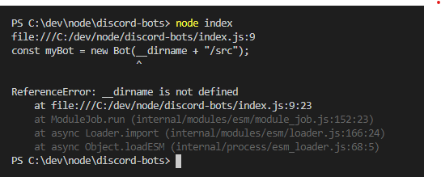
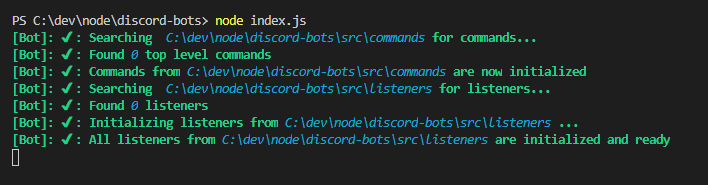

# Discord-Folders
## Discord-folders is a lightweight, simple to setup, simple to use, scalable framework for discod bots. It uses your file system to determine how it should function, making it super simple to visualize how your bot will function.

## Setup
### Install
First things first, install discord-folders in a already-set-up npm project via `npm i discord-folders`. This also installs `discord.js`, however to reconize it as a main dependincy in your project, `npm i discord.js` is also recomened. 

### Note: 
Becuase discord-folders uses your filesystem to determine bot behavior, it is very important that your project is set up exactly as it is in this tutorial. This could be the source of many hard to find bugs.

### Creating the structure
Inside of your root directory, you'll need at least 1 file (`index.js`) and one folder (`src`). `index.js` will be the entry point of the bot, and contain all the bot code. `src` will contain all the information that the bot will process. Inside of `src` we need two more folders, `commands` and `listeners`. `commands` will store all the accessable commands that you bot might provide (`!kick @user`, `!play https://www.youtube.com/watch?v=dQw4w9WgXcQ`, etc...), and `listeners` will store all the "global" event listeners for your bot, which can be used for tasks such as blocking certian words or sending a greeting message once a user joins.

### Note: 
discord-folders is set up to take advantade of both commonjs (`module.exports` and `require()`) and es6 (`import` and `export`) modules. Make sure you are using the correct system or nothing will work. As a quick tip, inside of discord folders, `import { x } from "discord-folders"` is the same as `const { x } = require("discord-folders")`, and `export default` is the same as `module.exports = `


### Editing `index.js`
Now that the project is set up, we can create the bot. Edit `index.js` to contain this code:
```js
import { Bot } from "discord-folders";

const myBot = new Bot(__dirname + "/src");

bot.login("Your Toekn Here");
```
Now, if you are using `require()`, and have edited this code using the note above, it should run fine, and you should see a green terminal. However, those using es6 will probably have an error similar to this:



This happens because `__dirname` is not defined when using es6 modules. The cleanest way is to manualy create a __dirname varible, so editing `index.js` to look like this should work: 
```js
import { Bot } from "discord-folders";
import { dirname } from 'path';
import { fileURLToPath } from 'url';

const __dirname = dirname(fileURLToPath(import.meta.url));

const myBot = new Bot(__dirname + "/src");

bot.login("Your Toekn Here");
```
You should now see these messages: 


